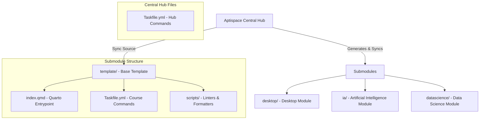

# Aptispace 🚀

Aptispace is a premium, unified Quarto course generator and publishing hub. It uses a monorepo architecture to streamline the creation, maintenance, and synchronization of gamified, interactive educational modules.

---

## 👥 Members & Identity
> [!IMPORTANT]
> **COMPLIANCE REQUIREMENT:** You must list the names of all group members here to satisfy compliance grading.
- **[Nom & Prénom Member 1]**
- **[Nom & Prénom Member 2]**

---

## 🏗️ 1. Architecture Overview

Aptispace utilizes a **Hub-and-Submodule Monorepo Architecture**. The root repository acts as the central control hub, while each individual course or project is integrated as a standalone Git Submodule.



### 📂 Directory Structure
```bash
/home/aptitek/Documents/Aptispace
├── Taskfile.yml              # Central hub automation tasks (New course, global publish, sync)
├── plan.md                   # Core active implementation tasks & logic updates
├── references_gem/           # Evaluation metrics, syllabus templates, and grading rubrics
│   ├── module.qmd            # Syllabus general metadata card
│   ├── notation.qmd          # Grading schema and validation checklist
│   ├── planning.qmd          # Interactive Gantt chart templates
│   ├── sujet.qmd             # Project guidelines and critical instructions
│   └── syllabus.qmd          # Structural outline and course deliverables
├── template/                 # The baseline template directory used for new courses
│   ├── Taskfile.yml          # Course-level rendering, previewing, and linting
│   ├── index.qmd             # Primary module course document template
│   ├── assets/               # CSS, SCSS, JS engines, and interactive assets
│   ├── _quarto.yml           # Core Quarto layout & design config
│   └── scripts/              # Automated code formatters & Quarto validation scripts
│       ├── code-lint.py      # Language-agnostic code block extraction & formatting
│       └── quarto-lint.py    # Quarto syntax nested validation & header formatting
└── [submodules]/             # Spawned course repositories (e.g. desktop, ia, datascience)
```

---

## ⚙️ 2. Core Automation & Tasks (`Taskfile.yml`)

Aptispace leverages a dual-layered `Taskfile.yml` structure to coordinate tasks at the global **Hub** level and local **Course** level.

### 🌐 Hub Tasks (Root `Taskfile.yml`)
Run these commands from the root directory of the workspace:

#### 🆕 Setup a New Course Module
Generates a new course directory, sets up synchronization points, registers a Cloudflare Pages project, initializes a GitHub repository, and attaches it as a submodule.
```bash
task new -- <SLUG>
# Example: task new -- docker
```

#### 🔄 Sync Template Updates
Automatically syncs all recent commits from `template/` to all active course submodules using patch diffs tracking `.template-sync` points.
```bash
task sync
```

#### 🚀 Publish Submodules (Single or Global)
Stages, commits, and pushes updates. If a slug is omitted, it will recursively update and publish **ALL** submodules and update the hub pointers.
```bash
# Publish a specific course
task publish <SLUG> "[commit message]"
# Example: task publish ia "feat: add neural network interactive diagram"

# Publish all course submodules at once
task publish "" "chore: global style updates"
```

---

### 📖 Course-Level Tasks (`template/Taskfile.yml` & Submodules)
Run these commands from inside a specific course submodule or the `template/` directory:

#### 🧹 Clean Build Cache
Cleans local Quarto build artifacts, generated site outputs, and internal databases.
```bash
task clean
```

#### 🛠️ Render Quarto Website
Renders the Quarto site to generate static assets under `_site/`.
```bash
task render
```

#### 👁️ Live Preview Server
Launches a local development server with hot-reload enabled to view page changes in real-time.
```bash
task preview
```

#### 📝 Code & Quarto Linting
Runs the comprehensive automated formatter and syntax verifier on all `.md` and `.qmd` documents.
```bash
task lint
```

#### 📤 Local Publish
Commits changes and pushes updates strictly on the `main` branch.
```bash
task publish -- "feat: complete interactive lab 1"
```

---

## 🎨 3. Coding Guidelines & Syntax Standard

To maintain high visual quality, clear structure, and correct rendering across all platforms, strict Markdown and Quarto formatting rules are enforced via our automated linters.

### 🧩 Automatic Linters Overview
All Markdown (`.md`) and Quarto (`.qmd`) files undergo validation when running `task lint`:
1. **`code-lint.py`**: Extracts code blocks, runs native formatters, and re-injects the beautifully formatted code.
2. **`quarto-lint.py`**: Balances Quarto structure, normalizes headers, aligns tables, and renumbers lists.

### 📝 Key Syntax & Formatting Standards

#### 1. Quarto Nesting & Divs
- Custom Quarto containers (`:::`) must be perfectly nested. The outer div is initialized using `:::` followed by options, and sub-divs require additional colons relative to their depth (e.g. `::::`).
- The `quarto-lint.py` script automatically verifies, nests, and balances any unclosed elements.
```markdown
::: {.info header="Note"}
This is the outer container.

:::: {.warning}
This is a nested inner alert.
::::
:::
```

#### 2. Code Block Language Support & Formatting
Code blocks are automatically linted and styled based on their tag using designated native formatters:
- **Python (`python`, `py`)**: Formatted via **Ruff** (v-env automated).
- **Frontend (`javascript`, `js`, `typescript`, `ts`, `json`, `html`, `css`, `scss`)**: Beautified via **jsbeautifier**.
- **C/C++/Java (`c`, `cpp`, `java`)**: Styled using **clang-format**.
- **YAML (`yaml`, `yml`)**: Standardized with **yamlfix** or Prettier.
- **Lua (`lua`)**: Styled with **StyLua** (automatically downloaded precompiled binary).
- **Shell (`bash`, `sh`)**: Formatted using **shfmt** (automatically downloaded precompiled binary).
- **TOML (`toml`)**: Formatted with **taplo** (automatically downloaded precompiled binary).

#### 3. Title Normalization & Header Hierarchy
- Titles must be hierarchically renumbered automatically (e.g., `## 1.2 Title`).
- Titles (`#` elements) **must not contain inline emphasis formatting** like bold (`**`) or italics (`*`). These are automatically stripped for SEO compliance.
- No separating horizontal rules (`---`) are allowed immediately above a heading, as Quarto handles this spacing natively.

#### 4. List Rendering Standards
- Ordered lists (`1.`, `2.`, `3.`) must be sequentially incremented and reset on different indentation levels.
- A blank newline **must be present** immediately above any list initialization block to guarantee correct HTML translation.

#### 5. Markdown Tables
- All Markdown tables must be padded and aligned according to alignment indicators (`:---`, `:---:`, `---:`). Table cells are automatically padded with spaces for readability in source code.

---

## 🔒 4. Compliance & Security Rules

> [!CAUTION]
> **CRITICAL COMPLIANCE RULES:** Failure to adhere to the following rules will result in major penalties or a grade of 0.

### 🔑 1. Security of API Keys (Zero Tolerance)
- **NEVER** commit API credentials, passwords, tokens, or security keys (e.g., OpenAI, HuggingFace, Google Gemini) to GitHub.
- Store sensitive configuration variables inside a local `.env` file.
- The `.env` file **must** be listed inside `.gitignore` in both the hub and submodules.

### 🖼️ 2. Execution Outputs & Visual Proofs
- Your notebooks (`.ipynb`) and interactive pages **must be fully executed** prior to submission.
- Ensure all execution logs, tables, model summary reports, and graph visualizations are embedded and fully visible.
- Use images or screenshots inside your deliverables to illustrate the operational status of your software.

### 🤖 3. AI Usage & Transparency declaration
If you use AI assistance (such as ChatGPT, Claude, Copilot, or Gemini) to write, optimize, or debug the code:
- You must include an **AI Transparency & Methodology** section in your final report.
- Clearly describe what prompts were used, which tools were consulted, and critique the quality/limitations of the AI's suggestions.
